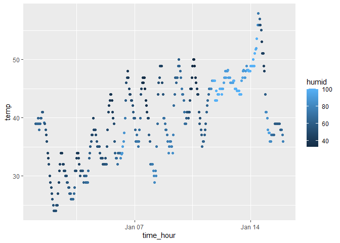

p8105_hw1_bp2678
================
Brady Pham
2023-09-22

# Problem 1

``` r
library(moderndive)
data("early_january_weather")
help("early_january_weather")
```

    ## starting httpd help server ... done

the variables for this dataset is

- origin (weather station)
- year (time of recording)
- month (time of recording)
- day (time of recording)
- hour(time of recording)
- temperature (in F)
- dewpoint (in F)
- realitve humidity
- wind direction (in degrees)
- wind speed (in mph)
- wind gust speed (in mph)
- precipitation (in inches)
- sea level pressure (in millibars)
- visibility (in miles)
- time hour (date and hour of the recording as a posixct date)

``` r
num_rows <- nrow(early_january_weather)
num_columns <- ncol(early_january_weather)
```

There are 15 columns and 358 rows!

``` r
mean_temperature <- mean(early_january_weather$temp, na.rm = TRUE)
```

The mean temperature 39.5821

``` r
library (ggplot2)
library(tidyverse)
```

    ## ── Attaching core tidyverse packages ──────────────────────── tidyverse 2.0.0 ──
    ## ✔ dplyr     1.1.3     ✔ readr     2.1.4
    ## ✔ forcats   1.0.0     ✔ stringr   1.5.0
    ## ✔ lubridate 1.9.2     ✔ tibble    3.2.1
    ## ✔ purrr     1.0.2     ✔ tidyr     1.3.0
    ## ── Conflicts ────────────────────────────────────────── tidyverse_conflicts() ──
    ## ✖ dplyr::filter() masks stats::filter()
    ## ✖ dplyr::lag()    masks stats::lag()
    ## ℹ Use the conflicted package (<http://conflicted.r-lib.org/>) to force all conflicts to become errors

``` r
scatterplot <- early_january_weather %>%
  ggplot(aes(x = time_hour, y =temp, color = humid)) + geom_point()
scatterplot
```

<!-- -->

The plot shows a general trend of the temperature increasing throughout
the month. It does seems like during the day and night that the
temperature fluctuates however it stil stays in the same trend.
Addiitonally, it looks like the day after Janurary 14th that the
temperature is going to decrease a lot.

``` r
ggsave(filename = "scatterplot.png",
       plot = scatterplot,           
       width = 6,                    
       height = 4)                 
```

# Problem 2

``` r
problem2_df = tibble(
  random_sample = rnorm(10),
logical_vector = random_sample > 0,
character_vector = c("A", "B", "C", "D", "E", "F", "G", "H", "I", "J"),
factor_vector = factor(c("red", "green", "blue", "red", "green", "blue", "red", "green", "blue", "red"),
                        levels = c("red", "green", "blue")))
problem2_df
```

    ## # A tibble: 10 × 4
    ##    random_sample logical_vector character_vector factor_vector
    ##            <dbl> <lgl>          <chr>            <fct>        
    ##  1       2.30    TRUE           A                red          
    ##  2      -1.49    FALSE          B                green        
    ##  3      -3.14    FALSE          C                blue         
    ##  4      -0.636   FALSE          D                red          
    ##  5      -2.09    FALSE          E                green        
    ##  6      -0.00185 FALSE          F                blue         
    ##  7      -0.849   FALSE          G                red          
    ##  8      -0.619   FALSE          H                green        
    ##  9      -1.26    FALSE          I                blue         
    ## 10      -0.781   FALSE          J                red

``` r
mean(pull(problem2_df, 'random_sample'))
```

    ## [1] -0.855433

``` r
mean(pull(problem2_df,'logical_vector'))
```

    ## [1] 0.1

``` r
mean(pull(problem2_df, 'character_vector'))
```

    ## Warning in mean.default(pull(problem2_df, "character_vector")): argument is not
    ## numeric or logical: returning NA

    ## [1] NA

``` r
mean(pull(problem2_df, 'factor_vector'))
```

    ## Warning in mean.default(pull(problem2_df, "factor_vector")): argument is not
    ## numeric or logical: returning NA

    ## [1] NA

The ones that work is the random sample and logical vecotr and the one
that doesn’t work is character vector and factor vector.

``` r
as.numeric(pull(problem2_df, logical_vector))

as.numeric(pull(problem2_df, character_vector))
  
as.numeric(pull(problem2_df, factor_vector))
```

When the as.numeric funciton is run with the variables logical_vector,
character_vector, and factor_vector only logical_vector an factor_vector
ran sucessfully. character_vector variable showed up as N/A. The reason
for this is because logical_vector is orignally assigned as true or
false so R set it as 0 and 1. For factor_vector it corresponds to the 3
levels that were assigned hence 1, 2, and 3. For character_Vector, R is
not able to assign an numeric equivalent to the variables hence why it
shows up as N/A. This does help explain what happens when we take the
mean.
